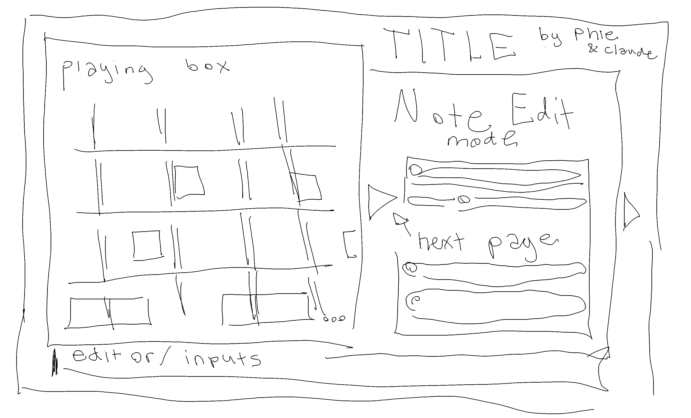

# mpwav — Design

Shared, commentable version (the one to edit and hand in):
https://claude.ai/code/artifact/4335e52a-e095-44b2-b6ed-ce0a0e6edf48 — this file is the repo copy, kept in step with it.

As of 2026-10-07. Status: agreed direction, not built yet.

## Overview

mpwav will open on an Ableton-style timeline where every track's music sits in colored blocks that you place, stretch, copy and paste. It is a browser music studio for musically inclined beginners and intermediates, sighted or visually impaired, built for Creative Coding & Innovation.

**The class brief requires:** it works on a phone, meets WCAG AA contrast, is fully keyboard-navigable and works with screen readers, ships as a live URL, and is tested by 5 people outside the class.

**What exists today** ([live site](https://soapiessoapies.github.io/mpwav/)): four synth tracks (Lead, Bass, Pad, Hat), a mixing desk, a 16-step pattern grid with slots A–D, recording from the keyboard, a 16-bar arrangement grid, the Sound tab (synth, morph pad, Warp effects) and tabs for small screens. This design replaces the pattern grid and arrangement grid with one timeline; the sound and mixer parts stay.

## Layout sketch

The screen splits into three areas: the timeline on the left, a paged editing panel on the right under the title, and an inputs strip across the bottom.

- **Transport bar** (above the playing box): Play, Record, tempo.
- **Playing box** (left, most of the screen): the timeline of clips. Track rows, bar lines, clips of different widths, and "…" where it keeps growing.
- **Title** (top right): the song's title and "by Phie & Claude".
- **Note Edit mode** (right): rows of sliders, a page at a time, with arrows between pages. Some pages edit the selected notes (length, loudness, pitch); the others edit the selected track's sound (synth, morph pad, Warp, output).
- **Editor / inputs** (bottom strip, full width): the keyboard and other input controls.

## The timeline (main view)

The app opens on the timeline: every track stacked as a row, time running left to right in bars, like Ableton's Arrangement View.

- **Tracks as rows.** Lead, Bass, Pad and Hat each get a row; the selected track's row is highlighted. Selecting a track is how you reach its output settings (sound, mixer, note length).
- **It grows as you work.** There is no fixed song length. The song ends a couple of empty bars after the last block, and placing a block near the end adds more room.
- **A playhead** sweeps across while playing. Tap or click the ruler at the top to move it; Play starts from there.
- **Loop brace.** A bracket on the ruler marks a section to repeat while you work on it (Ableton's loop switch). Off = play the whole song.
- **Zoom.** Pinch on a phone, Ctrl + wheel on Windows, or + / − buttons: zoomed out shows the whole song, zoomed in shows single steps.
- **Zoom bar (like Premiere Pro).** A thick bar under the timeline, and another under the piano roll, shows which part is in view. Drag its middle to scroll; drag either end to zoom. Double-click it, press Fit, or press \ to fit everything. Until you zoom by hand the song keeps fitting the width as it grows. The bar never gets thinner than a finger can grab, and from a keyboard its middle and ends are sliders (arrows, - / =, Home / End).
- **Collapsible rows.** Each track row folds to a thin strip; Collapse rows folds them all.

## Clips, not loose notes

Recommendation: the timeline holds **clips** (blocks of notes), and you open a clip to edit its notes, as in Ableton. It is the fastest way to arrange because you build a part once and reuse it everywhere.

| Action | With clips | With loose notes on the timeline |
| --- | --- | --- |
| Repeat a 1-bar beat for 8 bars | Drag the clip's right edge out | Copy and paste 8 times |
| Change the beat everywhere it repeats | Edit one linked clip | Edit every copy by hand |
| Make a variation | Duplicate the clip, then edit the copy | Select, copy, paste, edit |
| See the song's shape | Named, colored blocks per section | Thousands of tiny notes |

- **Clip editor.** Double-click (tap twice on a phone) a clip to open its notes in a piano-roll editor docked under the timeline. Notes are the colored blocks described below.
- **Linked vs independent copies.** Alt-drag (or Copy as linked) makes a linked copy that changes when the original does; a normal copy is independent. Linked clips show a small chain mark.
- **Clip library.** Each track keeps a list of its clips (this replaces the A–D slots, with no limit of four). Clips get names like "Verse beat", and can be dragged from the list onto the timeline.
- **Recording** makes a new clip where the playhead is, or adds into the clip under it (adding with Undo take, as now).

## Placing notes

In the clip editor, scrolling moves through the pitch rows, tapping places a note, and the keyboard can type notes in at a cursor. All three work on phone and Windows.

**Scrolling the pitch rows.** The editor shows about one octave at a time; scroll up and down for higher or lower notes, with the piano keys along the left edge as a guide.

| | Phone | Windows |
| --- | --- | --- |
| Move through pitches | Swipe up / down | Mouse wheel |
| Move through time | Swipe left / right | Shift + wheel, or the scrollbar |
| Place a note | Tap a square | Click a square |
| Zoom | Pinch | Ctrl + wheel |

Scrolling works well on Windows too: a wheel is quicker than the current − / + row buttons, and those buttons stay for keyboard and screen-reader users.

**Keyboard as the pitch input (step input).** Put the cursor at a point in the clip, then press a piano key (on screen or A W S E D…): that note lands at the cursor and the cursor moves on by one note length. Hold two keys for a chord. This is also the main way screen-reader users write music, since it needs no pointing.

**Note length.** Every note is a block whose width is how long it plays. Drag a block's right edge to stretch or shorten it, or set a default length for new notes (1/16, 1/8, 1/4, 1/2, one bar). It replaces today's per-track Note length dropdown, so one bass part can mix long and short notes. Keyboard: Shift + ← / → shortens or lengthens the selected notes.

## Color blocks

Each track has a color range you choose, and every note is a shade in that range set by its key, so a track's notes all read as one family and the same key always gets the same shade.

- **Per-track color.** Pick a track color from a set of swatches (orange, mint, sky, violet, rose, lime, gold, coral). The swatches are chosen so text and edges on them pass WCAG AA.
- **Shade by key.** The 12 keys (C, C#, D…B) step from deep to light through the track's color, e.g. every C on the Lead track is its deepest orange and every B its lightest. Octave doesn't change the shade.
- **Clips** on the timeline show the track color, with the notes inside drawn as tiny blocks in their key shades, so you can spot repeated parts at a glance.
- **Never color alone.** Note blocks also show their name (C4, E4) when wide enough, the row tells you the pitch, and screen readers hear "E 4, beat 3, quarter note". People who can't tell the shades apart lose nothing.
- **Option:** color by key across all tracks (every C the same color everywhere), for spotting chords and clashes between tracks.

## Copy, paste and selection

Everything can be selected and copied: notes inside a clip, whole clips, or a time range across every track. Paste lands at the playhead or cursor.

| What | Select it by | Then |
| --- | --- | --- |
| Notes in a clip | Click / tap a note; Shift adds more; drag a box around several; Ctrl + A for all | Copy, cut, paste, duplicate, delete, move, transpose (↑ / ↓ one key, Shift + ↑ / ↓ an octave) |
| Clips | Click / tap a clip; Shift adds more; drag a box on the timeline | Copy, paste, duplicate, linked copy, delete, move, rename, recolor |
| A section (a time range, all tracks) | Drag along the ruler | Copy, paste, duplicate, insert empty bars, delete bars |

- **Shortcuts (Windows):** Ctrl + C / X / V, Ctrl + D duplicate (places the copy right after), Delete, Ctrl + Z / Ctrl + Y undo and redo.
- **Phone:** long-press selects and opens a small action bar (Copy, Paste, Duplicate, Delete, Link); a second finger tap adds to the selection.
- **Screen readers:** the same actions are buttons in the action bar, and each one is announced ("3 notes copied", "Pasted at bar 5").
- **Undo everything.** One undo history covers notes, clips, sections and recording takes.
- **Patterns.** The Note page stamps a rhythm on the cursor's key (beats, eighths, sixteenths, off-beats, backbeat, tresillo, clave), repeats the selected notes to the end of the clip every 1, 2 or 4 beats or every bar, and turns a selected chord into an arpeggio (up, down, up-down). In Edit keys mode the number keys do the same: 1-7 stamp, 8 / 9 / 0 arpeggiate.
- **Keys mode.** Play keys (default) makes the computer keyboard a piano; Edit keys turns letters into editing shortcuts (Ctrl + E switches). Shortcuts without Ctrl can be turned off in Settings for speech input users. Press ? for the full list.

## Arranging the windows

Settings › Arrange panels (Ctrl + Shift + L) lets people lay the studio out for how they work. The four panels (playing box, clip editor, Note Edit, keyboard) sit in three columns: main, side and bottom.

- Drag a panel by its handle to another place or column, or use its Move up / Move down / Place in controls (the same moves from a keyboard or a screen reader).
- The side column can sit on the left; an empty side column gives the main column the full width.
- Every panel can collapse to its header.
- Reset layout returns to the standard one. Done or Escape leaves arrange mode; the layout is saved with the other view settings.

## Tempo

Notes are placed in bars and beats, not seconds, so changing the tempo speeds the song up or slows it down without moving anything, like replaying video frames at a different frame rate.

- **Any tempo, any time.** Type a BPM or drag the number (20–300). It can change while playing; the song keeps its place.
- **Tap tempo.** Tap the Tap tempo button in time with the beat you hear in your head; the BPM follows your last few taps. (No T shortcut: T already plays F# on the computer keyboard.)
- **Tempo changes along the song.** Tempo markers on the ruler: a marker at bar 9 can switch from 110 to 140, either as a jump or as a gradual ramp up to it. The ruler shows the BPM at each marker.
- **Set the tempo after recording (stretch goal).** Record freely without a click, then mpwav suggests a tempo from the notes' spacing and snaps them to the grid. Snapping already works; guessing the tempo is the hard part, so this comes last.
- **Metronome.** An optional click while playing or recording, with a one-bar count-in before recording starts.

## Tracks, panels and song settings

Selecting a track (its row name on the timeline) switches every side panel to that track; the Sound and mixer designs stay as they are, split into smaller sections to fit beside the timeline.

- **Track panel** (opens for the selected track), in collapsible sections:
    - Sound: preset, synth, morph pad, Warp — today's Sound tab.
    - Output: fader, pan, mute, solo, color.
    - Notes: default note length, scale helper.
- **Mixer** stays a desk of strips; on wide screens it can sit at the bottom like Ableton's mixer, or open as its own view.
- **Song customization:**
    - Add, remove, rename and reorder tracks (not fixed at four); any preset on any track.
    - Song title, time signature (4/4 to start; 3/4 and 6/8 later), swing amount.
    - Key and scale helper: pick a key (e.g. A minor) and notes outside it are dimmed in the editor; optional snap-to-scale.
    - Snap grid: 1/4, 1/8, 1/16, 1/32, triplets, or off.
    - Save several songs, open and rename them; export to WAV.
- The finer details are left for later, as agreed.

## Phone, Windows and accessibility

One app serves both, following the layout sketch: Windows shows the playing box, the Note Edit panel and the inputs strip together; a phone shows one area at a time.

| Area | Windows (wide screen) | Phone |
| --- | --- | --- |
| Transport (Play, Record, tempo) | Bar above the playing box | Top bar |
| Playing box (timeline) | Left, most of the screen | Full screen, all tracks |
| Title | Top right, above the Note Edit panel | Top bar, shortened |
| Note Edit panel | Right side, paged sliders with ◀ ▶ arrows | Slides up from the bottom, one page at a time |
| Editor / inputs | Strip across the bottom: keyboard and input controls | Pinned at the bottom, can be hidden |

**Accessibility (WCAG AA):**

- The timeline and clip editor are grids of real buttons: arrow keys move, Enter places or opens, and a screen reader hears "Bass, bar 5, clip Verse beat" or "E 4, beat 3, quarter note".
- Step input (keyboard as pitch) lets anyone write music without dragging.
- Every drag has a keyboard or button version (move, stretch, select, copy).
- Colors pass contrast checks automatically (the existing test covers every new color), and color never carries meaning alone.

## Open questions and build order

The layout sketch is in the Layout sketch section; these questions come from reading it.

**Open questions**

- [x] Note Edit mode: both, on different pages — note pages for the selected notes, sound pages for the selected track.
- [x] Notes live in clips; open a clip in the playing box to edit its notes.
- [x] Play, Record and tempo sit in a bar above the playing box.
- [ ] Should linked copies be the default when dragging a clip, or normal copies?
- [ ] Which track colors and how many tracks should a new song start with?
- [ ] Is the Week 9 phone test about writing a beat from scratch, or remixing the demo? It decides what the MVP must have.

**Build order** (each step usable on its own and pushed live)

1. Done: timeline with tracks, clips, playhead, ruler and zoom; today's patterns became the first clips. Settings added: layout, background (high contrast by default), fullscreen, credits.
2. Done: clip editor as a piano roll with colored note blocks, scroll through pitches, stretchable lengths, the Note page.
3. Done: copy, cut, paste and duplicate for notes and clips, linked copies, section tools (duplicate, insert bar, delete) on the loop range, and one undo history (Ctrl + Z / Ctrl + Y) for every edit.
4. Done: step input from the keyboard (chords too), and recording into clips with held lengths.
5. Done: tap tempo, metronome, one-bar count-in before recording, tempo changes along the song (jumps or ramps), shown on the ruler.
6. Done: Track page (rename, 8 colors, reorder, remove, add up to 12 tracks) and Song page (key and scale with dimmed rows and optional keep-in-key, snap from 1/16 to a bar, swing). Still to come: time signatures other than 4/4 and triplet snap, which need a finer timing grid.
7. Done: a Songs list (new, from the demo, duplicate, open, delete; saved in the browser), Export WAV (the whole song with its effects and mix), and export / import of a song file. Still to come: suggesting a tempo from a free recording, which needs recording without snapping first.
8. Done: faster note editing (patterns, Play / Edit keys modes, shortcut list), Premiere-style zoom bars with zoom to fit, collapsible track rows, and Arrange panels (drag, move or collapse panels; side column left or right).
9. Done: accessibility pass (axe plus manual WCAG 2.2 AA checks; fixes listed below) and install as an app with offline use.
10. Done: the look, modeled on Bezier (Settings › Look and Motion).

**Next round (agreed 2026-10-08, after renaming the app mpwav)**

11. Done: one screen on desktop. Every panel fits the window and scrolls inside itself (no more gap under Note Edit); a splitter between panels shares the room; Section and Tempo tools moved into menus; the keyboard's tools sit beside the keys; the how-to text moved to Settings › Tutorial › Show tips (screen readers still hear it).
12. Done: clips that show more, and notes edited right on the timeline. Taller rows (they stretch to fill the playing box on one screen), a dark note area in each clip with blocks shaded by key, brightness by loudness and note names when zoomed in. Press a note to select it (its clip opens in the piano roll and the Note page), drag to move it on the snap grid, drag its right end to stretch it, double-click to delete it, Shift to add to the selection. The piano roll stays the keyboard way.
13. Done: per-note sound. Each note can carry its own sound on top of its track's (`fx` on the note, only what's moved off its default): pitch slide over the note, pitch sweep at the start (lasers, zaps, drum hits), fine tune, vibrato, brightness (the track's filter opened or closed), pan, retrigger (stutters and rolls, with a slide carried across the repeats) and a noise burst. Edited on the Note page for the selected notes, with Hear it and Reset; heard live and in Export WAV; kept through copy, paste, repeat and saving. Notes with their own sound wear a dot.
14. Done: sound files (.wav, .mp3, anything the browser decodes), both ways. Files are stored in the browser's IndexedDB (`src/state/samples.js`); songs keep their ids, and exported song files carry them inside. **Audio tracks** hold audio clips, drawn as waveforms and snapped to bars like any clip (loops up to 64 bars); an open audio clip shows a wave editor in place of the piano roll: drag or type the trim, fade in / out, gain, reverse, fit to tempo (sped up or slowed like a record so it fills the loop), loop the whole sound, replace it, hear it. **Sampler:** a synth track's Instrument (Note Edit › Sound) can be a sound file, pitched by key from a root note and still shaped by the filter, envelope, Warp and per-note sound. Drop files on the timeline: an audio row makes clips where they land, a synth row takes the first as its instrument. Live playback and Export WAV both play them. Still to come: stretching time without changing pitch.
15. Done: readable on big screens. Text grows with the screen (Settings › Text and control size: Auto, or Small to Extra large), the side column grows too (360–560 px), and pressable text (track names, the Keyboard toggle, checkboxes, the song title) sits in a soft-bordered box.

## Accessibility audit (2026-10-08)

Checked with axe-core (WCAG 2.0 to 2.2 AA plus best practice) in every layout (320, 390, 800 and 1280 px wide), every Note Edit page, the clip editor, all dialogs and arrange mode, then by hand for what axe can't judge. Fixed:

- **Nested controls:** the zoom bar's end handles were inside its middle slider; now they sit beside it.
- **Dragging (2.5.7):** a "Plays for N bars" box stretches a clip without dragging. Every other drag already had a button or field.
- **Target size (2.5.8):** bars never get narrower than 24 px, so ruler buttons and one-bar clips stay tappable (the zoom bar scrolls the rest); phone black keys are 24 px wide.
- **Focus not obscured (2.4.11):** focus never hides under the sticky transport bar or the pinned phone keyboard.
- **Reflow (1.4.10):** at 320 px (the same as 400% zoom) the transport and keyboard header fit without scrolling sideways.
- **Labels:** the phone layout hid the tempo field's label from screen readers; the page heading moved inside the main landmark.
- **Fewer Tab stops:** the ruler and each track's clips are one Tab stop each (arrows move along them): the timeline went from 36 stops to 13.

Already passing: contrast in every theme (unit-tested), text spacing (1.4.12), reduced motion, single-key shortcuts can be turned off (2.1.4), live announcements for every edit.

Still worth testing with people: NVDA on Windows and VoiceOver on iPhone, during the Week 9 sessions.

## Install and offline

mpwav is a PWA: `manifest.webmanifest`, icons drawn by `tools/make-icons.js`, and a service worker (`sw.js`). Settings › App has an Install button where the browser supports one (Chrome, Edge) and the steps for Safari on iPhone / iPad. The service worker fetches fresh files when online (so pushes show up on the next load) and falls back to its cache offline or after 3 seconds on a slow connection.

## The look (modeled on Bezier)

The interface borrows Bezier's design language (the class's drawing app) while keeping mpwav's own colors, so high contrast stays the default and every background still works. Bezier's poster colors, logo and swoosh stay Bezier's.

- **Type:** Nunito for words; the song title in Caveat Brush over a little sound wave (in place of Bezier's swoosh); Pixelify Sans on the Note Edit tabs. Numbers stay in Nunito with even-width digits, because in the pixel font a small 2, 3 or 5 reads as an 8.
- **Paper tabs:** each Note Edit page is its own paper (a hint of a track color over the panel, with fine grain). The open tab stands taller and runs into its page; the row scrolls sideways when the tabs don't fit.
- **Settings › Look** (like Bezier's):
  - *Smooth:* soft, rounded controls (the paper tabs stay).
  - *Pixel details* (default): pixel-block sliders with a round handle, circle toggles, notched tabs, chunky outlines with a hard offset shadow, and the transport as a rounded tool strip.
  - *All pixel:* also squares off buttons, fields, dialogs and clips, with a pressed-in shade on whatever is on.
- **Motion:** a nod, not a show. Buttons dip when pressed, a new page or dialog settles into place, and the picked tab hops once. Settings › Motion turns it off; so does the system's reduce-motion setting.
- **Contrast:** outlines on paper use the lighter edge gray, and tests/contrast.test.js checks text, quiet text, the accent and outlines on every paper in every background.

## Song files, Home and the guided tour (v0.9.0)

**Song files.**
- A `.mpwav` file holds the song plus every sound it uses, so it opens
  anywhere (`src/state/song-files.js`).
- **Save** (Ctrl+S): in Chrome and Edge the first save asks where, and later
  saves write straight to that file. Other browsers, and iPhone/iPad,
  download a copy each time.
- **Home** opens on every launch. It has New song, New from the demo,
  Open a song file, Back to the studio, exports and the song list.

**Guided tour** (`src/ui/tour.js`). Testers said mpwav is hard to grasp at
first, so this is a short walk through the studio, in the same style as
Critters' coach marks.
- The screen dims, one real control is ringed, and a bubble explains it,
  with Back / Next / Skip and "n of 10".
- The steps: Play, the timeline, New clip, the clip editor, the keys,
  Record, Note Edit, Tempo, Home, Settings. A step whose control isn't on
  screen is skipped.
- It runs once on a first visit, after Home closes. Settings > Tutorial >
  Take the tour replays it.
- Accessible:
  - The bubble is a labelled dialog, and focus stays on its buttons.
  - Esc ends the tour, and focus returns to where it was.
  - Each step is announced.
  - Space and letter keys don't play anything behind it.

## Borrowed from other music apps (v0.10.0)

We looked at how beginner-friendly music apps get people making something
fast, and compared that with what mpwav has.

| App | Tool | In mpwav |
| --- | --- | --- |
| GarageBand | Chord strips: one touch plays a whole chord | **Added:** chord buttons |
| Chrome Music Lab Song Maker | Share a song as a link; MIDI keyboard input | **Added:** share links and MIDI input |
| Song Maker, BandLab | A drum lane or drum pads | Not yet (proposed) |
| BandLab | Looper packs: genre loops to start from | Not yet (proposed) |
| BandLab | Automation lanes (volume, effects over time) | Not yet (proposed) |
| GarageBand Live Loops, Ableton Session | A grid of clips you launch live | Not yet (proposed, large) |
| BandLab, Song Maker | Record from the microphone | Not yet (proposed) |
| Ableton | Scale highlighting in the note editor | Already had: in-key shading, keep-in-key |

**Built:**
- **Chord buttons** (`src/ui/chords.js`).
  - A row above the piano with the seven chords of the song's key, each
    with its numeral (I ii iii IV V vi vii° in major).
  - One press plays the whole chord through the same path as the keys, so
    it records, step-inputs and sounds on the selected track.
  - With no scale, or a 5- or 6-note scale, the chords come from the major
    key on the song's root (blues uses the minor key's).
  - Accessible: Enter holds a chord, and a screen reader's activate plays a
    short one.
- **MIDI keyboard** (`src/ui/midi.js`, Settings > Keyboard).
  - Opt-in, because the browser asks permission.
  - Keyboards plugged in later connect by themselves.
  - Note-on with velocity 0 counts as a release.
- **Share links** (`src/state/share-link.js`, Home > Copy share link).
  - The song is compressed (deflate) into the link's #fragment, so nothing
    is sent to a server. The demo song comes to about 1,400 characters.
  - Opening a link adds a copy to the opener's songs and skips Home.
  - Songs with sound files are too big, so those point to Save song file.

**Proposed next, in order:**
1. A drum track: kick, snare and hat on one grid, with a few starting
   patterns.
2. Starter loops by genre.
3. Mic recording into an audio clip.
4. Automation for volume and filter.
5. A clip-launch grid.

## Drum tracks (v0.11.0)

The first proposal from "Borrowed from other music apps" is built: a drum
track, like Song Maker's drum lane and BandLab's drum pads.

**How it works:**
- **Add a drum track** (Track page). It starts with a 1-bar Four on the
  floor clip, repeated over the loop (4 bars when the loop is off).
- **The kit:** eight synthesized drums, no sound files, each on its General
  MIDI note: kick 36, snare 38, clap 39, closed hat 42, low tom 45, open
  hat 46, crash 49, high tom 50.
  - A MIDI drum pad plays the right drum.
  - A closed hat chokes a ringing open hat.
  - The drums play through the track's volume, Warp effects and Mix.
- **The drum grid:** a drum track's clip editor shows one named row per
  drum instead of every pitch. It reads as a "drum grid" to screen readers,
  and arrows move between drums.
- **Drum beats** (Note page): Four on the floor, Rock, Hip-hop, Half-time,
  Breakbeat, Toms. Each is added over every bar of the open clip, and hits
  already there stay.
- **Keys play drums:**
  - White keys from the keyboard's lowest C: C kick, D snare, E clap,
    F closed hat, G open hat, A low tom, B high tom, the next C crash.
  - Computer keys: A S D F G H J K.
  - A legend replaces the chord buttons while a drum track is selected.
  - Recording and step input work the same way.
- **Level:** drum peaks are matched to a synth pad chord (about 0.12 vs
  0.10 in a render).
